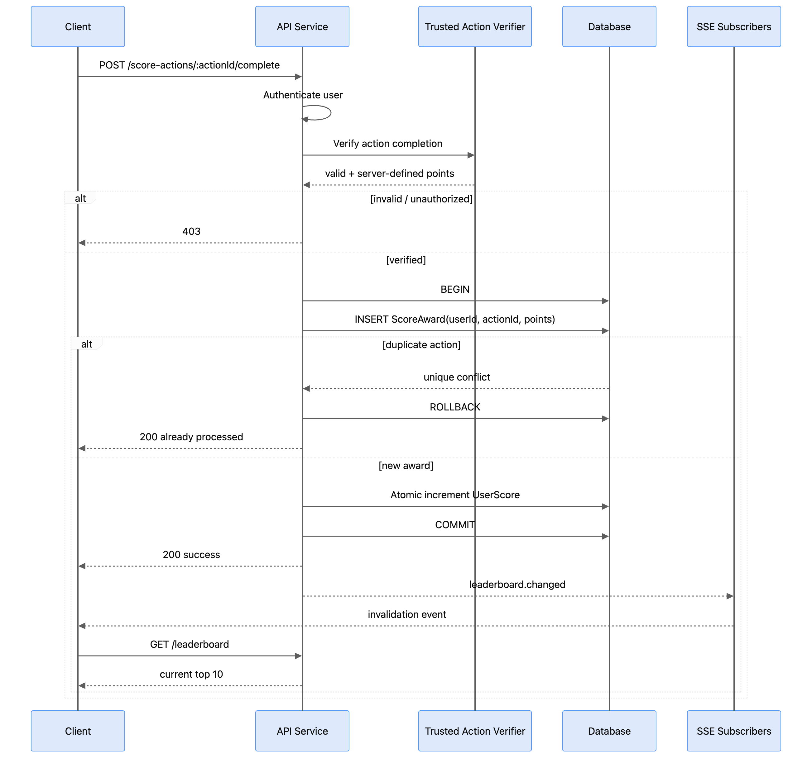

# Scoreboard Module

Backend module for maintaining a top-10 scoreboard, updating it after a verified user action, and notifying connected clients when the leaderboard changes.

## Requirements

- Show the top 10 users by score.
- Update the scoreboard live.
- A completed action may increase the authenticated user's score.
- One logical action must award score at most once.

## Assumptions

- Authentication already exists and provides the current `userId`.
- Each completed action has a unique `actionId` representing one logical completion.
- The backend has a trusted way to verify that `actionId` was genuinely completed by the authenticated user.
- The points awarded for an action are decided by the server, not supplied by the client.

## API

### `POST /score-actions/:actionId/complete`

Records one verified action completion and awards its score.

**Authentication:** required.

**Client input:**

- `actionId` in the URL.

**Responses:**

- `200 OK` — action was accepted and score awarded.
- `200 OK` — the same action was already awarded; no duplicate increment is performed.
- `400 Bad Request` — invalid request.
- `401 Unauthorized` — unauthenticated.
- `403 Forbidden` — action cannot be verified for this user.
- `500 Internal Server Error` — server failure; no success is returned before the database transaction commits.

### `GET /leaderboard`

Returns the current top 10 users.

Example response:

```json
{
  "users": [
    { "userId": "u1", "score": 120 },
    { "userId": "u2", "score": 110 }
  ]
}
```

Ordering must be deterministic, for example:

```text
score DESC, user_id ASC
```

### `GET /leaderboard/events`

Server-Sent Events (SSE) stream.

Event:

```text
event: leaderboard.changed
data: {}
```

The event is an **invalidation signal**, not the source of truth. After receiving it, the client refetches `GET /leaderboard`.

## Data Model

```text
ScoreAward
- user_id
- action_id
- points
- created_at
- UNIQUE(user_id, action_id)

UserScore
- user_id PRIMARY KEY
- score
- updated_at
```

`ScoreAward` records accepted scoring events. `UserScore` stores the current score used by leaderboard reads.

Both writes must occur in the same database transaction.

## Execution Flow



## Correctness and Security Rules

1. Only verified action completion can increase score.
   - use trusted server-side verifier.

2. The client cannot choose the target user.
   - use `userId` from authentication context.

3. The client cannot choose the score delta.
   - points come from server-side rules/verifier.

4. One logical action awards at most once.
   - use `UNIQUE(user_id, action_id)` in the database.

5. Award record and user score cannot diverge.
   - one database transaction.

6. Concurrent valid actions must not lose increments.
   - atomic database increment, e.g. `score = score + :points`.

7. Success is returned only after durable commit.

8. Leaderboard notifications are not authoritative state.
   - `GET /leaderboard` remains the source used to render the UI.

## Tests

- Valid verified action -> one award + one score increment.
- Forged/unverified action -> no score change.
- Concurrent requests with the same `actionId` -> exactly one award.
- Concurrent distinct valid actions -> no lost increments.
- Failure between award insert and score update -> transaction rolls back both.
- Retry after committed-but-response-lost -> no duplicate score.
- Duplicate/out-of-order SSE events -> final UI matches `GET /leaderboard`.

## Improvement Notes

- Define exactly how the server proves an action was completed. If action completion already happens on the server, prefer triggering score award internally instead of trusting a client completion request.
- If score volume later makes `ORDER BY score DESC LIMIT 10` too expensive, introduce a index/cache representation only after measuring the need.
